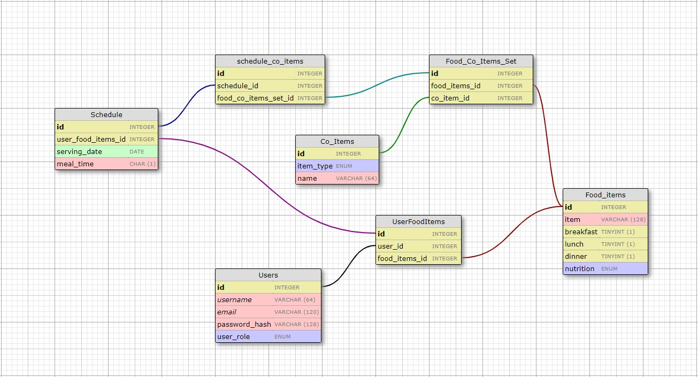

# Food Selector Project, Round 2

See project in its current state here: https://food-selector-2.herokuapp.com/

I'm expanding this project with a new backend architecture, and changing it from a simple random generator tool to a whole meal-planning app with random-selection capabilities.

## To Clone this Repo
1. `git clone https://github.com/pbrahmac/food-selector-round-2.git` in your desired local directory
2. Install virtualenv using `pip install virtualenv`
3. Create virtualenv using `python3 -m venv venv` and activate it using `source venv/bin/activate`
4. Install all dependencies using `pip install -r requirements.txt`
5. Run the project on localhost:5000 using `flask run` or on a public local IP using `python3 food-selector.py`

## Database schema for this Project

